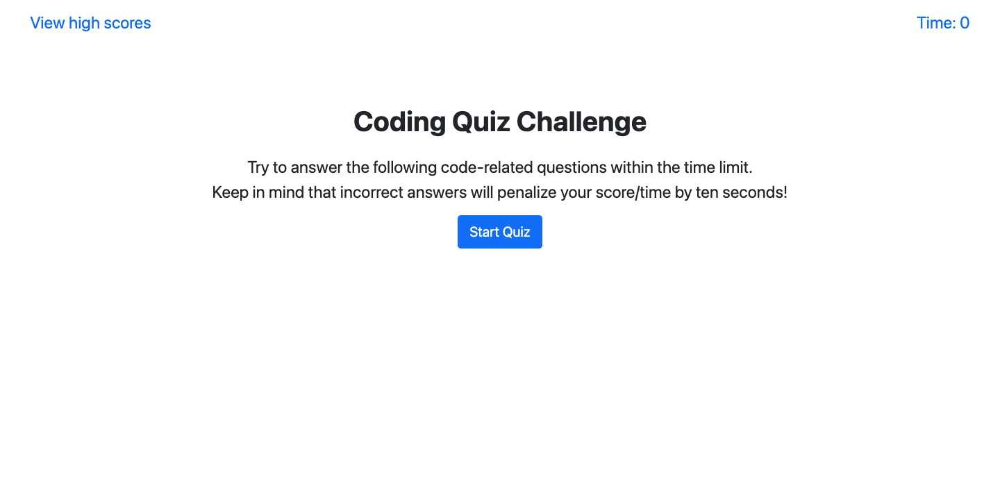
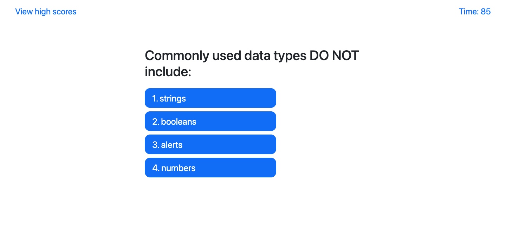
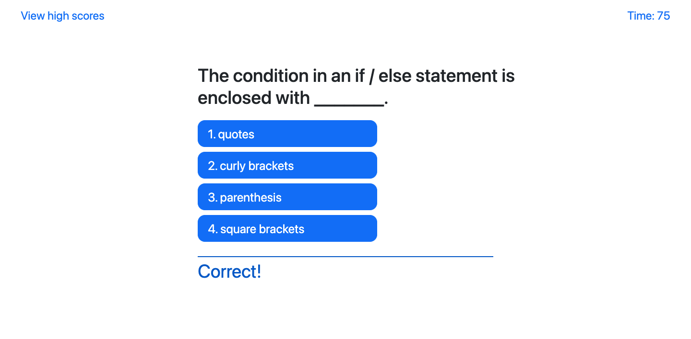
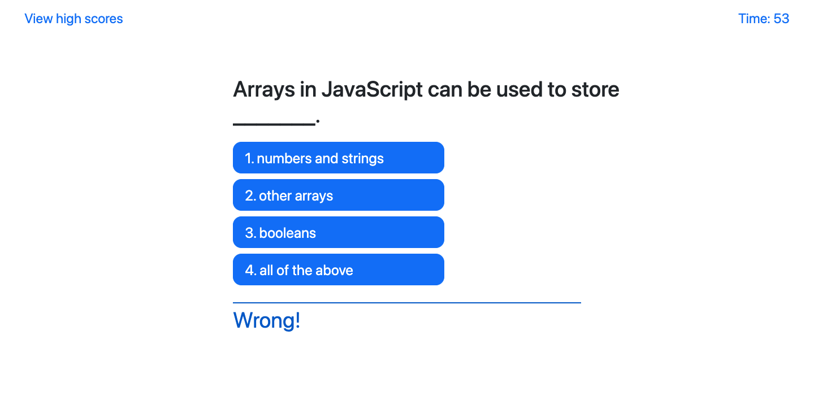

# Code Quiz

## Description

This application is a timed coding quiz with multiple-choice questions, running in the browser. It has a clean, polished, and responsive user interface.

When players click the start button, a timer starts and they will be presented with a question. By clicking on one of the answers, next question will show up with the feedback of the previous question (Wrong or Correct). When wrong, 10 seconds will be subtracted from the clock. Once all questions are answered or the timer reaches 0, the game is over. If players answer all questions correctly, the score will be equivalent to the time left. Players can save their score by providing their initials. The pair of initials and score will be stored in the localStorage. Finally, players is provided with choices of go back to the initial page and clear the stored high scores.

## Built With
* HTML
* CSS
* JavaScript
* localStorage

## Website
https://siyanguo.github.io/code-quiz/

## Contribution
< > with ❤️ by Serena Guo

